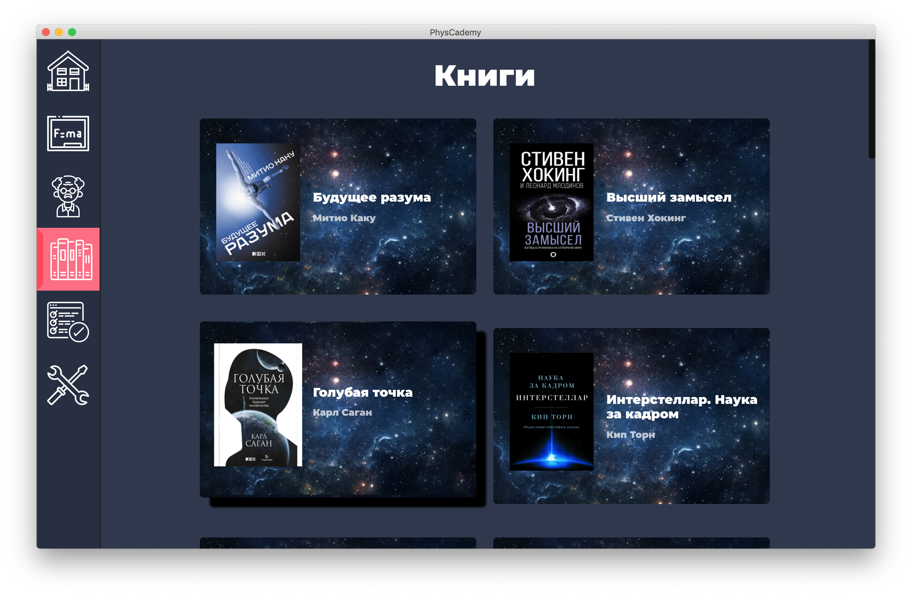

# PhysCademy 

**PhysCademy** - это приложение, позволяющее любому желающему ближе познакомиться с миром физики, изучая теорию, узнавая о жизни учёных и подбирая книги, которые заставят вас влюбиться в эту науку.

## Скриншоты приложения




## Скрипты

Для старта:
``` bash
> yarn
> yarn dev # Запуск локального сервера для разработки
> yarn dev:electron # Запуск Electron сервера для разработки
> yarn build # Сборка веб версии проекта
> yarn build:electron # Сборка desktop версии проекта
```

> ### Абдельсалам Шади, 11МИ5
> #### Лицей НИУ ВШЭ